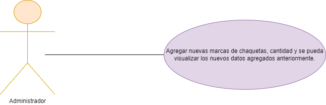
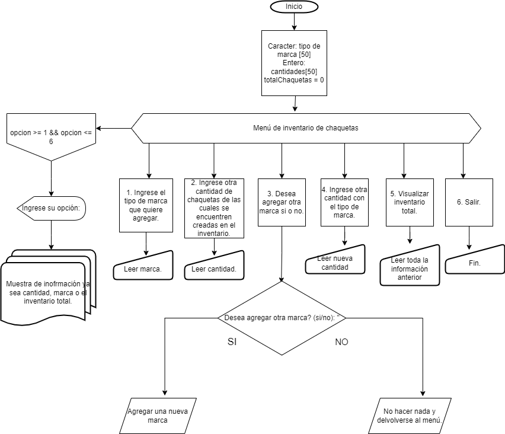

# HU- Administrar inventario de chaquetas

El usuario, como administrador de inventario, desea agregar marcas y cantidades de chaquetas y visualizar el inventario actual. El escenario implica ingresar una marca, agregar la cantidad correspondiente y luego validar el inventario para un mejor manejo. El usuario espera poder ver las cantidades de chaquetas según las marcas agregadas.

**Descripcion del caso de uso**
Nombre: Agregar Inventario de Chaquetas
Actores: Administrador de Inventario
Propósito: Permitir al Administrador agregar nuevas marcas y la cantidad de chaquetas de cada marca al inventario, y visualizar el inventario actual.

Curso Normal de Eventos:
1. El Administrador selecciona la opción de agregar inventario.
2. El Administrador ingresa el nombre de la marca que desea agregar.
3. El Administrador ingresa la cantidad de chaquetas de la marca que desea agregar.
4. El sistema registra la nueva marca y la cantidad de chaquetas en el inventario.
5. El Administrador puede elegir agregar otra marca y cantidad o visualizar el inventario actual.
6. Si el Administrador elige visualizar el inventario, el sistema muestra la lista de marcas y la cantidad de chaquetas de cada marca en el inventario actual.

Postcondiciones: 
- Las nuevas marcas y la cantidad de chaquetas agregadas se registran en el inventario.
- El Administrador puede ver el inventario actualizado con las nuevas marcas y la cantidad de chaquetas.

  

**Pseudocódigo**
Inicio
    Declarar una variable entera opcion y una variable booleana opcionValida
    Declarar un arreglo de cadenas de longitud 50 llamado marcas
    Declarar un arreglo de enteros de longitud 50 llamado cantidades
    Declarar una variable entera totalChaquetas y asignarle el valor cero
    Mientras opcion no sea igual a 6, hacer lo siguiente:
        Imprimir "MENU DE INVENTARIO DE CHAQUETAS"
        Imprimir "1. Ingrese el tipo de marca que quiere agregar."
        Imprimir "2. Ingrese otra cantidad de chaquetas de las cuales se encuentren creadas en el inventario."
        Imprimir "3. Desea agregar otra marca si o no."
        Imprimir "4. Ingrese otra cantidad con el tipo de marca."
        Imprimir "5. Visualizar inventario total."
        Imprimir "6. Salir."
        Mientras opcionValida sea falso, hacer lo siguiente:
            Imprimir "Ingrese su opción: "
            Leer opcion
            Si opcion está entre 1 y 6, inclusive, entonces
                asignar verdadero a opcionValida
            De lo contrario, imprimir "Opción no válida. Intento de nuevo."
        Fin de mientras
        asignar falso a opcionValida
        Según opcion, hacer lo siguiente:
            caso 1:
                Llamar a la función agregarMarca()
                romper
            caso 2:
                Llamar a la función agregarCantidad()
                romper
            caso 3:
                Llamar a la función preguntarAgregarMarca()
                romper
            caso 4:
                Llamar a la función actualizarCantidad()
                romper
            caso 5:
                Llamar a la función visualizarInventario()
                romper
            caso 6:
                Imprimir "Saliendo del programa..."
                romper
            De lo contrario, imprimir "Opción no válida."
        Fin de según
        Imprimir una línea en blanco
    Fin de mientras
Fin

