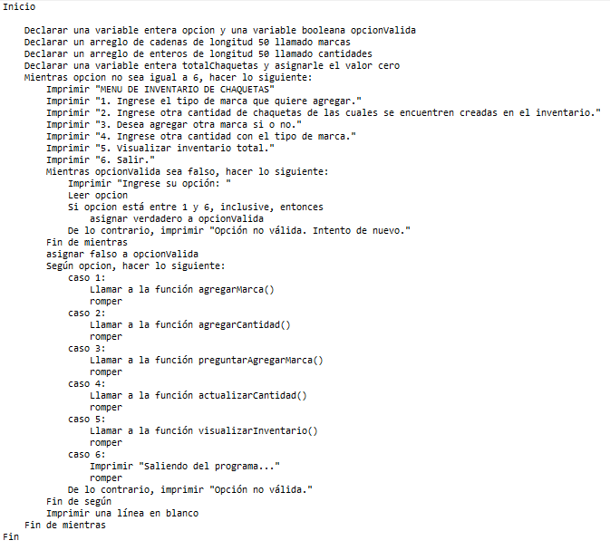

# HU- Administrar inventario de chaquetas

El usuario, como administrador de inventario, desea agregar marcas y cantidades de chaquetas y visualizar el inventario actual. El escenario implica ingresar una marca, agregar la cantidad correspondiente y luego validar el inventario para un mejor manejo. El usuario espera poder ver las cantidades de chaquetas según las marcas agregadas.

**Descripcion del caso de uso**
Nombre: Agregar Inventario de Chaquetas
Actores: Administrador de Inventario
Propósito: Permitir al Administrador agregar nuevas marcas y la cantidad de chaquetas de cada marca al inventario, y visualizar el inventario actual.

Curso Normal de Eventos:
1. El Administrador selecciona la opción de agregar inventario.
2. El Administrador ingresa el nombre de la marca que desea agregar.
3. El Administrador ingresa la cantidad de chaquetas de la marca que desea agregar.
4. El sistema registra la nueva marca y la cantidad de chaquetas en el inventario.
5. El Administrador puede elegir agregar otra marca y cantidad o visualizar el inventario actual.
6. Si el Administrador elige visualizar el inventario, el sistema muestra la lista de marcas y la cantidad de chaquetas de cada marca en el inventario actual.

Postcondiciones: 
- Las nuevas marcas y la cantidad de chaquetas agregadas se registran en el inventario.
- El Administrador puede ver el inventario actualizado con las nuevas marcas y la cantidad de chaquetas.

  

**Pseudocódigo**

